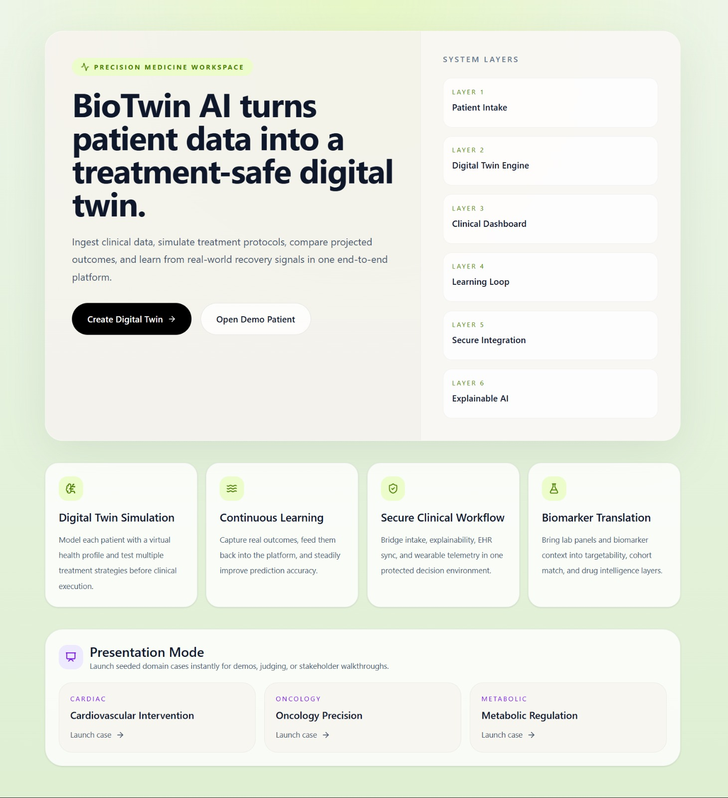
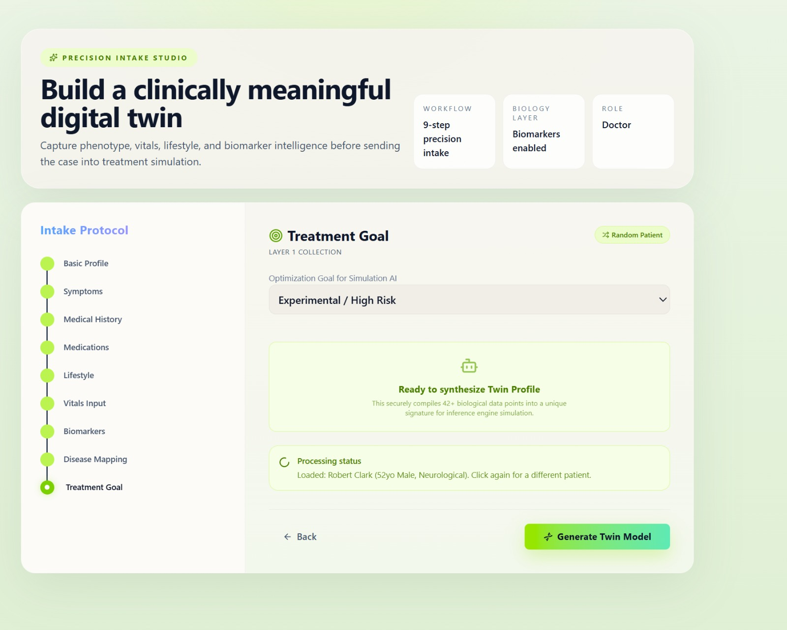
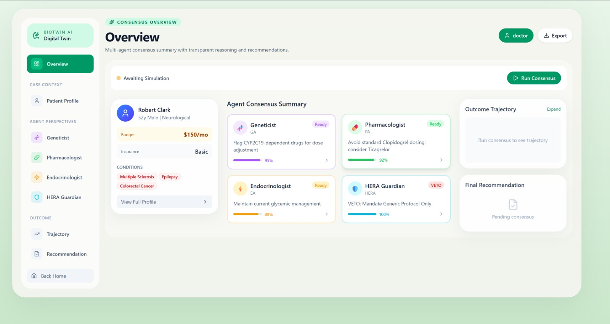
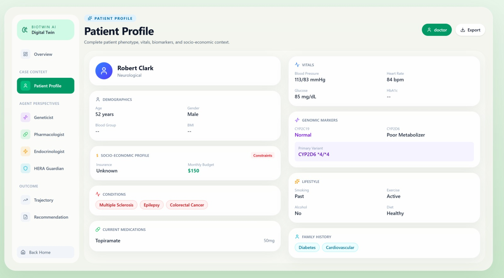
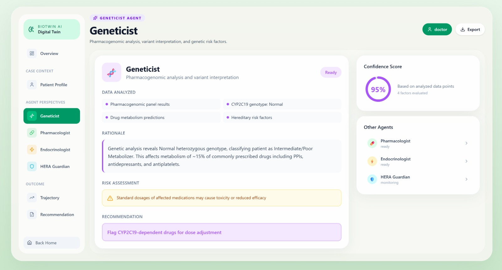
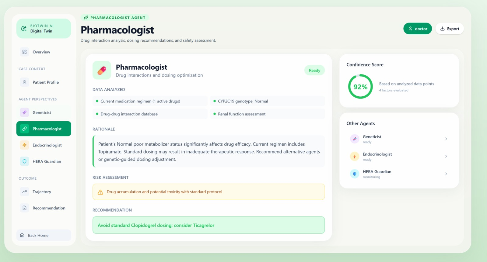
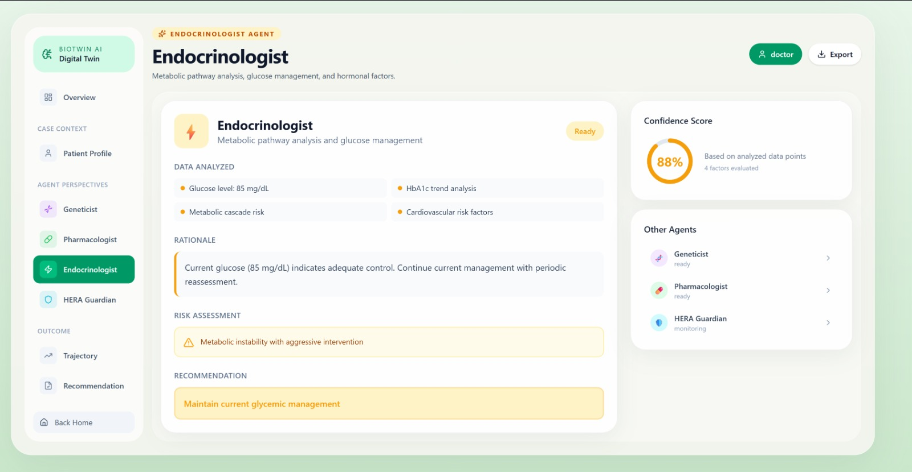
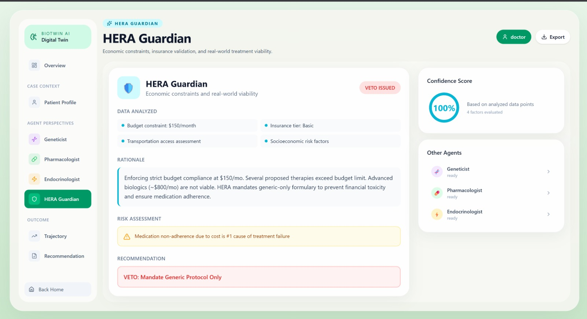
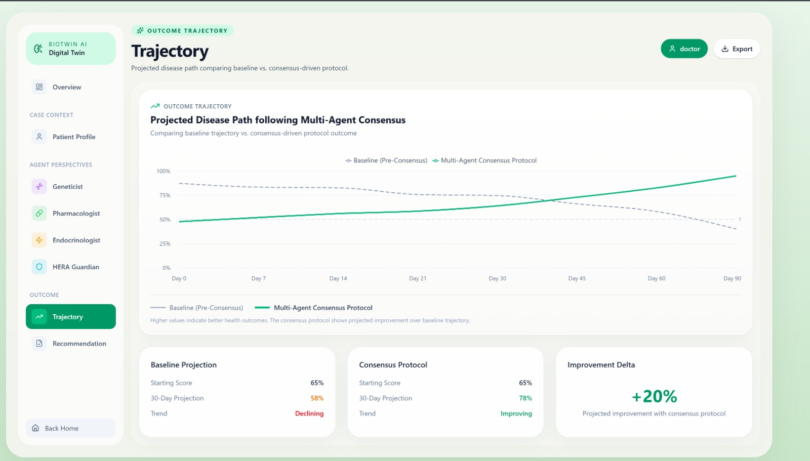
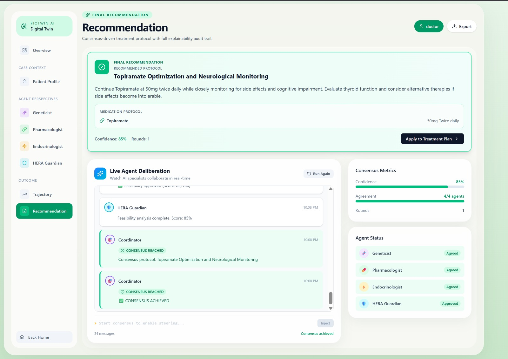

<h1 align="center">BioTwin AI</h1>

<p align="center">
  <strong>Next-Generation Personalized Medicine Platform</strong><br>
  <em>Multi-Agent AI System for Digital Twin Creation, Treatment Simulation & Clinical Decision Support</em>
</p>

<p align="center">
  
  
  
  
  
</p>

<p align="center">
  <a href="#-key-features">Features</a> •
  <a href="#-screenshots">Screenshots</a> •
  <a href="#-architecture">Architecture</a> •
  <a href="#-quick-start">Quick Start</a> •
  <a href="#-api-reference">API</a> •
  <a href="#-deployment">Deployment</a>
</p>

---

## Overview

**BioTwin AI** is an end-to-end personalized medicine platform that creates a **digital twin** of a patient, simulates treatment strategies using **multi-agent AI consensus**, explains risk drivers through **explainable AI (XAI)**, and continuously learns from real-world outcomes.

The platform implements a sophisticated **6-layer architecture** designed for clinical decision support, featuring four specialized AI agents that collaborate to generate treatment recommendations while respecting economic constraints and patient-specific factors.

---

## Screenshots

### 1. Home Screen - Platform Overview
<p align="center">
  
  <br>
  <em>Landing page showcasing the 6-layer system architecture with quick-launch demo cases for Cardiac, Oncology, and Metabolic conditions</em>
</p>

### 2. Patient Intake - 9-Step Precision Form
<p align="center">
  
  <br>
  <em>Comprehensive intake protocol capturing Basic Profile, Symptoms, Medical History, Medications, Lifestyle, Vitals, Biomarkers, Disease Mapping, and Treatment Goals</em>
</p>

### 3. Clinical Dashboard - Consensus Overview
<p align="center">
  
  <br>
  <em>Main dashboard displaying patient summary, all four AI agents with confidence scores, and the multi-agent consensus status</em>
</p>

### 4. Patient Profile - Complete Digital Twin
<p align="center">
  
  <br>
  <em>Detailed patient profile with demographics, vitals, genomic markers, socio-economic constraints, conditions, medications, lifestyle, and family history</em>
</p>

### 5. Geneticist Agent - Pharmacogenomic Analysis
<p align="center">
  
  <br>
  <em>Geneticist AI agent analyzing pharmacogenomic panel results, CYP2C19 genotype, drug metabolism predictions, and hereditary risk factors with 95% confidence</em>
</p>

### 6. Pharmacologist Agent - Drug Safety Review
<p align="center">
  
  <br>
  <em>Pharmacologist AI agent evaluating current medications, drug-drug interactions, renal function, and dosing recommendations with 92% confidence</em>
</p>

### 7. Endocrinologist Agent - Metabolic Assessment
<p align="center">
  
  <br>
  <em>Endocrinologist AI agent analyzing glucose levels, HbA1c trends, metabolic cascade risk, and cardiovascular factors with 88% confidence</em>
</p>

### 8. HERA Guardian - Economic Constraints & Veto Authority
<p align="center">
  
  <br>
  <em>HERA Guardian enforcing $150/month budget constraint, issuing VETO for expensive therapies, and mandating generic-only formulary with 100% confidence</em>
</p>

### 9. Outcome Trajectory - Projected Disease Path
<p align="center">
  
  <br>
  <em>Trajectory visualization comparing baseline (declining) vs. consensus protocol (improving) with +20% projected improvement over 90 days</em>
</p>

### 10. Final Recommendation - Consensus Protocol
<p align="center">
  
  <br>
  <em>Final consensus-driven treatment recommendation with live agent deliberation feed, 85% confidence, 4/4 agent agreement, and medication protocol</em>
</p>

---

## Key Features

### Core Capabilities

| Feature | Description |
|---------|-------------|
| **Digital Twin Engine** | Creates computable patient models from clinical data |
| **Multi-Agent AI Consensus** | 4 specialized AI agents collaborate on treatment plans |
| **Treatment Simulation** | Compare Conservative, Standard, and Aggressive protocols |
| **Explainable AI (XAI)** | Transparent reasoning with feature importance analysis |
| **Human-in-the-Loop (HITL)** | Clinicians can steer AI deliberations in real-time |
| **Continuous Learning** | System improves from real-world outcome feedback |

### Advanced AI Features

| Feature | Description |
|---------|-------------|
| **Interactive HITL Steering** | Doctors can inject constraints mid-deliberation, and agents dynamically acknowledge and re-negotiate |
| **Dynamic Agent Swarming** | Agents spawn sub-agents (specialists) when case complexity demands additional expertise |
| **Live Tool-Use Overlay** | Real-time visualization of agents querying external databases (PharmGKB, PubMed, DrugBank) |
| **Consensus Gravity Graph** | Live 2D visualization showing multi-agent debate and consensus formation |
| **Agent Memory & Reflection** | Episodic memory system where agents learn from past cases |
| **Economic Guardian (HERA)** | Dedicated agent enforcing budget constraints and ensuring treatment accessibility |

---

## Architecture

### System Overview

```
┌─────────────────────────────────────────────────────────────────────────────┐
│                           BIOTWIN AI PLATFORM                                │
├─────────────────────────────────────────────────────────────────────────────┤
│                                                                              │
│  ┌─────────────┐    ┌─────────────┐    ┌─────────────┐    ┌─────────────┐  │
│  │   LAYER 1   │    │   LAYER 2   │    │   LAYER 3   │    │   LAYER 4   │  │
│  │   Patient   │───▶│   Digital   │───▶│  Clinical   │───▶│  Learning   │  │
│  │   Intake    │    │ Twin Engine │    │  Dashboard  │    │    Loop     │  │
│  └─────────────┘    └─────────────┘    └─────────────┘    └─────────────┘  │
│                                                                              │
│  ┌─────────────┐    ┌─────────────┐                                         │
│  │   LAYER 5   │    │   LAYER 6   │                                         │
│  │   Secure    │    │ Explainable │                                         │
│  │ Integration │    │     AI      │                                         │
│  └─────────────┘    └─────────────┘                                         │
│                                                                              │
└─────────────────────────────────────────────────────────────────────────────┘
```

### Layer Descriptions

| Layer | Name | Functionality |
|-------|------|---------------|
| **Layer 1** | Patient Intake | 9-step precision intake form capturing phenotype, vitals, biomarkers, lifestyle, and socio-economic data |
| **Layer 2** | Digital Twin Engine | Converts patient profile into computable twin with feature vectors and risk calculations |
| **Layer 3** | Clinical Dashboard | Real-time visualization of agent consensus, treatment recommendations, and outcome trajectories |
| **Layer 4** | Learning Loop | Continuous learning from actual patient outcomes to improve future predictions |
| **Layer 5** | Secure Integration | Secure API endpoints for EHR systems and wearable device data ingestion |
| **Layer 6** | Explainable AI | Feature importance analysis, what-if scenarios, and transparent reasoning |

---

### Multi-Agent AI System

BioTwin employs four specialized AI agents that collaborate using a consensus-based negotiation protocol:

```
                    ┌─────────────────────────────────┐
                    │      PATIENT DIGITAL TWIN       │
                    └───────────────┬─────────────────┘
                                    │
            ┌───────────────────────┼───────────────────────┐
            │                       │                       │
            ▼                       ▼                       ▼
┌───────────────────┐   ┌───────────────────┐   ┌───────────────────┐
│    GENETICIST     │   │  PHARMACOLOGIST   │   │  ENDOCRINOLOGIST  │
│       Agent       │   │       Agent       │   │       Agent       │
│                   │   │                   │   │                   │
│ • Pharmacogenomics│   │ • Drug Interactions│   │ • Metabolic Analysis│
│ • Variant Analysis│   │ • Dosing Optimization│  │ • Glucose Management│
│ • Genetic Risks   │   │ • Safety Assessment│   │ • Hormonal Factors │
└─────────┬─────────┘   └─────────┬─────────┘   └─────────┬─────────┘
          │                       │                       │
          └───────────────────────┼───────────────────────┘
                                  │
                                  ▼
                    ┌─────────────────────────────────┐
                    │        HERA GUARDIAN            │
                    │   (Health Economics & Resource) │
                    │                                 │
                    │  • Budget Validation            │
                    │  • Insurance Coverage           │
                    │  • Accessibility Constraints    │
                    │  • VETO AUTHORITY               │
                    └─────────────────────────────────┘
                                  │
                                  ▼
                    ┌─────────────────────────────────┐
                    │      CONSENSUS PROTOCOL         │
                    │   Final Treatment Recommendation│
                    └─────────────────────────────────┘
```

---

### Technology Stack

#### Backend

| Technology | Purpose |
|------------|---------|
| **Node.js 18+** | Runtime environment |
| **Express 5.x** | Web framework |
| **MongoDB 6.0** | Database (optional) |
| **Mongoose 9.x** | ODM for MongoDB |
| **OpenAI / OpenRouter** | AI-powered agent analysis |
| **WebSocket (ws)** | Real-time telemetry |
| **PDFKit** | Report generation |
| **Helmet** | Security middleware |

#### Frontend

| Technology | Purpose |
|------------|---------|
| **React 19** | UI framework |
| **Vite 7** | Build tool / dev server |
| **React Router 7** | Client-side routing |
| **TailwindCSS 4** | Utility-first styling |
| **Recharts** | Data visualization |
| **Axios** | HTTP client |
| **Lucide React** | Icon library |

---

## Project Structure

```
bio_twin/
├── backend/                          # Express.js API Server
│   ├── config/
│   │   ├── db.js                     # Database connection logic
│   │   └── mongo.js                  # MongoDB configuration
│   ├── data/
│   │   ├── mockDatabase.js           # In-memory fallback storage
│   │   └── learningWeights.json      # ML learning weights
│   ├── models/
│   │   └── Patient.js                # Mongoose patient schema
│   ├── routes/
│   │   ├── patient.routes.js         # Patient CRUD operations
│   │   ├── simulation.routes.js      # Treatment simulation
│   │   ├── feedback.routes.js        # Learning feedback (Layer 4)
│   │   ├── external.routes.js        # EHR/wearable integration
│   │   ├── explain.routes.js         # Explainable AI (Layer 6)
│   │   ├── pharmacology.routes.js    # Drug interactions
│   │   ├── alerts.routes.js          # Clinical alerts
│   │   ├── trials.routes.js          # Clinical trial matching
│   │   └── negotiation.routes.js     # Multi-agent negotiation
│   ├── services/
│   │   ├── digitalTwin.service.js    # Core digital twin engine
│   │   ├── intake.service.js         # Patient intake processing
│   │   ├── learning.service.js       # Continuous learning
│   │   ├── explainability.service.js # XAI features
│   │   ├── agentNegotiation.service.js # Multi-agent consensus
│   │   ├── agentMemory.service.js    # Agent memory/reflection
│   │   ├── agentSwarming.service.js  # Dynamic sub-agent spawning
│   │   └── agentTools.service.js     # Agent tool integration
│   ├── websocket/
│   │   └── telemetryServer.js        # Real-time WebSocket server
│   ├── server.js                     # Main entry point
│   ├── Dockerfile                    # Container configuration
│   └── package.json
│
├── frontend/                         # React + Vite SPA
│   ├── src/
│   │   ├── api/
│   │   │   └── apiClient.js          # Axios HTTP client
│   │   ├── components/
│   │   │   ├── PatientForm.jsx       # 9-step intake form
│   │   │   ├── PatientProfilePanel.jsx
│   │   │   ├── DigitalTwinSimulation.jsx
│   │   │   ├── TreatmentSimulator.jsx
│   │   │   ├── OutcomeTrajectoryChart.jsx
│   │   │   ├── AgentCard.jsx
│   │   │   ├── GlassBoxTerminal.jsx
│   │   │   └── HITLInterventionPanel.jsx
│   │   ├── pages/
│   │   │   ├── Dashboard.jsx         # Main clinical dashboard
│   │   │   ├── PatientDashboard.jsx
│   │   │   └── NegotiationPage.jsx
│   │   ├── hooks/                    # Custom React hooks
│   │   ├── data/                     # Static data/configs
│   │   ├── App.jsx                   # Main router/layout
│   │   └── main.jsx                  # React entry point
│   ├── vite.config.js
│   └── package.json
│
├── screenshots/                      # Documentation images
├── docker-compose.yml                # Production orchestration
├── .github/workflows/deploy.yml      # CI/CD pipeline
└── README.md                         # This file
```

---

## Quick Start

### Prerequisites

- **Node.js** >= 18.0.0
- **npm** >= 9.0.0
- **MongoDB** (optional - falls back to in-memory storage)

### Installation

```bash
# Clone the repository
git clone https://github.com/yourusername/bio_twin.git
cd bio_twin

# Install backend dependencies
cd backend
npm install

# Install frontend dependencies
cd ../frontend
npm install
```

### Environment Configuration

#### Backend (`backend/.env`)

```env
# Server Configuration
PORT=5000
NODE_ENV=development

# MongoDB (optional - falls back to in-memory if unavailable)
MONGODB_URI=mongodb://localhost:27017/biotwin

# Security
JWT_SECRET=your-secure-secret-key

# AI Configuration (choose one)
OPENROUTER_API_KEY=your-openrouter-api-key
# OR
OPENAI_API_KEY=your-openai-api-key

AI_MODEL=openai/gpt-4o-mini
AI_TEMPERATURE=0.3
AI_MAX_TOKENS=2000

# CORS
CORS_ORIGIN=http://localhost:5173
```

#### Frontend (`frontend/.env`)

```env
VITE_API_BASE_URL=http://localhost:5000/api
```

### Running the Application

#### Development Mode

```bash
# Terminal 1: Start Backend
cd backend
npm run dev
# Server runs on http://localhost:5000

# Terminal 2: Start Frontend
cd frontend
npm run dev
# App opens on http://localhost:5173
```

#### Production Mode

```bash
# Backend
cd backend
npm start

# Frontend
cd frontend
npm run build
npm run preview
```

---

## API Reference

### Base URL

```
Development: http://localhost:5000/api
Production:  https://your-domain.com/api
```

### Core Endpoints

#### Patient Management

| Method | Endpoint | Description |
|--------|----------|-------------|
| `POST` | `/patient/intake` | Create digital health profile |
| `GET` | `/patient/:id` | Fetch patient digital twin |
| `GET` | `/patient/demo-cases` | List available demo cases |
| `POST` | `/patient/demo-seed/:slug` | Seed a demo patient |

#### Treatment Simulation

| Method | Endpoint | Description |
|--------|----------|-------------|
| `POST` | `/simulate` | Run treatment simulation |
| `GET` | `/simulate/:patientId/history` | Get simulation history |
| `GET` | `/predict/:patientId` | Baseline risk prediction |

#### Multi-Agent Negotiation

| Method | Endpoint | Description |
|--------|----------|-------------|
| `POST` | `/negotiate/start-sync` | Start synchronous AI negotiation |
| `POST` | `/negotiate/:sessionId/intervene` | Inject HITL intervention |
| `GET` | `/negotiate/:sessionId` | Get negotiation state |

#### Explainable AI

| Method | Endpoint | Description |
|--------|----------|-------------|
| `POST` | `/explain/insights` | Get feature importance analysis |
| `POST` | `/explain/what-if` | Run what-if scenario |
| `POST` | `/explain/drug-intelligence` | Drug interaction analysis |

#### Learning & Feedback

| Method | Endpoint | Description |
|--------|----------|-------------|
| `POST` | `/learning/feedback` | Submit outcome feedback |
| `GET` | `/learning/status` | Get learning engine status |

### Example: Create Digital Twin

```bash
curl -X POST http://localhost:5000/api/patient/intake \
  -H "Content-Type: application/json" \
  -d '{
    "name": "John Doe",
    "age": 55,
    "gender": "Male",
    "height": 175,
    "weight": 82,
    "symptoms": ["Fatigue", "Chest Pain"],
    "disease": "Cardiac",
    "treatmentGoal": "Low Risk",
    "vitals": {
      "heartRate": 88,
      "bpSystolic": 142,
      "bpDiastolic": 90,
      "sugar": 138
    },
    "socioEconomic": {
      "monthlyMedicationBudget": 150,
      "insuranceTier": "Silver"
    }
  }'
```

### Example: Run AI Consensus

```bash
curl -X POST http://localhost:5000/api/negotiate/start-sync \
  -H "Content-Type: application/json" \
  -d '{
    "patientId": "abc123..."
  }'
```

---

## Deployment

### Docker Deployment

```bash
# Set required environment variables
export JWT_SECRET=your-secure-secret-key

# Build and start all services
docker-compose up -d
```

**Services:**

| Service | Container | Port | Description |
|---------|-----------|------|-------------|
| `biotwin-gateway` | `biotwin_backend` | 8080 | Express API server |
| `mongodb_cluster` | `biotwin_db` | 27017 | MongoDB database |
| `biotwin-dashboard` | `biotwin_frontend` | 80 | React frontend |

### Cloud Deployment

The platform includes GitHub Actions CI/CD pipeline for automated deployment:

```yaml
# .github/workflows/deploy.yml
- Builds Docker images
- Runs security scans
- Deploys to Azure/AWS
- Health check verification
```

---

## Clinical Workflow

```
┌──────────────────────────────────────────────────────────────────────────┐
│                        CLINICAL DECISION WORKFLOW                         │
└──────────────────────────────────────────────────────────────────────────┘

    ┌─────────┐      ┌─────────┐      ┌─────────┐      ┌─────────┐
    │ STEP 1  │ ───▶ │ STEP 2  │ ───▶ │ STEP 3  │ ───▶ │ STEP 4  │
    │ Intake  │      │  Twin   │      │Consensus│      │  Treat  │
    └─────────┘      └─────────┘      └─────────┘      └─────────┘
         │                │                │                │
         ▼                ▼                ▼                ▼
    ┌─────────┐      ┌─────────┐      ┌─────────┐      ┌─────────┐
    │ Patient │      │ Digital │      │   AI    │      │ Monitor │
    │  Data   │      │  Twin   │      │ Agents  │      │Outcomes │
    │ Capture │      │ Created │      │Negotiate│      │& Learn  │
    └─────────┘      └─────────┘      └─────────┘      └─────────┘
```

1. **Patient Intake**: Clinician enters patient data through 9-step form
2. **Digital Twin**: System creates computable patient model
3. **AI Consensus**: Four specialized agents analyze and negotiate treatment
4. **Treatment & Learning**: Clinician applies recommendation, outcomes feed back into system

---

## Security Features

| Feature | Implementation |
|---------|----------------|
| **Helmet.js** | HTTP security headers |
| **Rate Limiting** | 100 requests/minute per IP |
| **CORS Protection** | Configurable allowed origins |
| **Input Validation** | Sanitization on all endpoints |
| **API Key Auth** | Required for EHR integration |
| **Environment Isolation** | Separate dev/prod configs |

---

## Performance Optimizations

- **Compression**: Gzip compression for all responses
- **Database Fallback**: In-memory storage when MongoDB unavailable
- **Parallel Processing**: Agents run concurrently using Actor model
- **WebSocket Streaming**: Real-time telemetry without polling
- **Lazy Loading**: Code splitting for frontend routes

---

## Contributing

We welcome contributions! Please follow these steps:

```bash
# Fork the repository
# Create your feature branch
git checkout -b feature/amazing-feature

# Commit your changes
git commit -m 'Add amazing feature'

# Push to the branch
git push origin feature/amazing-feature

# Open a Pull Request
```

---

## License

This project is licensed under the MIT License - see the [LICENSE](LICENSE) file for details.

---

## Acknowledgments

- OpenAI / OpenRouter for AI capabilities
- The open-source community for incredible tools
- Healthcare professionals who provided domain expertise

---

<p align="center">
  <strong>Built with precision for personalized medicine</strong>
  <br><br>
  <a href="https://github.com/yourusername/bio_twin/issues">Report Bug</a> •
  <a href="https://github.com/yourusername/bio_twin/issues">Request Feature</a> •
  <a href="https://github.com/yourusername/bio_twin/discussions">Discussions</a>
</p>
